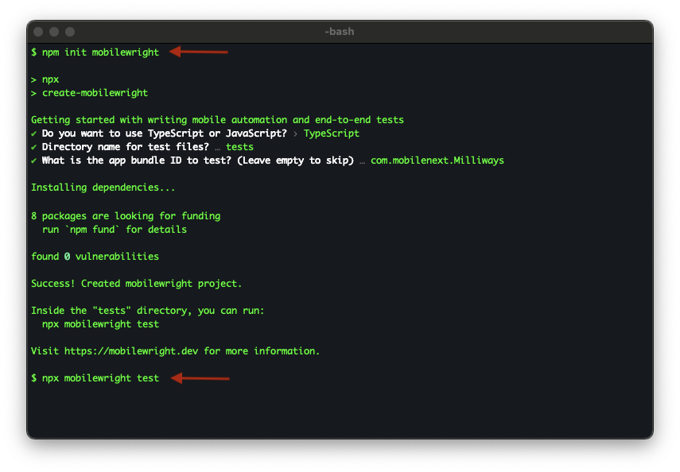

# create-mobilewright

Scaffold a [Mobilewright](https://mobilewright.dev) test project in seconds.

## Usage

```sh
npm init mobilewright
```

Also works with Yarn (`yarn create mobilewright`) and pnpm (`pnpm create mobilewright`).

The CLI walks you through setup and creates a ready-to-run project:



## What you get

```
my-project/
  mobilewright.config.ts   # Device and app configuration
  tests/
    example.spec.ts        # A working test you can run immediately
  package.json
```

## Run your first test

```sh
cd my-project
npx mobilewright test
```

That's it. 

If this is the first time you are running a test on iOS (simulator or real device), you will need to run `npx mobilewright install` to set up the agent on the device.

If something's missing, `npx mobilewright doctor` tells you exactly what to fix.

## Next steps

- [Mobilewright docs](https://mobilewright.dev/docs) — API reference and guides
- [mobile-use.com](https://mobile-use.com) — Run tests on real devices in the cloud

## License

Apache
